# Cute Date Link 💕

> A super cute way to ask someone out without the awkward talking stage. Built for fun, deployed for chaos.

A Next.js application that generates shareable links for asking someone out. The recipient gets a cute page with cat GIFs and Yes/No buttons. When they respond, you get an email notification. Simple, cute, and effective.

---

## 📋 Table of Contents

- [Features](#features)
- [Architecture](#architecture)
- [How It Works](#how-it-works)
- [Tech Stack](#tech-stack)
- [Setup & Installation](#setup--installation)
- [Environment Variables](#environment-variables)
- [Deployment](#deployment)
- [API Documentation](#api-documentation)
- [Data Privacy & Retention](#data-privacy--retention)
- [Project Structure](#project-structure)
- [Troubleshooting](#troubleshooting)

---

## ✨ Features

- 🎨 **Super cute UI** with adorable cat GIFs and smooth animations
- 🔗 **Unique shareable links** generated instantly
- 📧 **Email notifications** when someone responds (YES or NO)
- ⏰ **Auto-expiration** after 7 days (data deleted automatically)
- 🎭 **Progressive "No" button** that changes text with each click
- 🔧 **Development mode** to skip emails/storage (save free tier limits!)
- 🚀 **Vercel-ready** deployment
- 📊 **Analytics** via Vercel Analytics

---

## 🏗️ Architecture

### System Architecture Diagram

```mermaid
graph TB
    User[👤 User] -->|1. Create Link| Homepage[Homepage<br/>app/page.tsx]
    Homepage -->|POST /api/create-link| CreateAPI[Create Link API<br/>app/api/create-link/route.ts]
    CreateAPI -->|Store| Redis[(Upstash Redis<br/>7-day TTL)]
    CreateAPI -->|Return URL| Homepage
    Homepage -->|2. Share Link| Recipient[👤 Recipient]
    
    Recipient -->|3. Visit Link| AskPage["Ask Page<br/>app/ask/id/page.tsx"]
    AskPage -->|GET /api/check-link| CheckAPI[Check Link API<br/>app/api/check-link/route.ts]
    CheckAPI -->|Read| Redis
    CheckAPI -->|Return Status| AskPage
    
    AskPage -->|4. Submit Response| RespondAPI[Respond API<br/>app/api/respond/route.ts]
    RespondAPI -->|Update Status| Redis
    RespondAPI -->|Send Email| Resend[Resend Email Service]
    Resend -->|Email Notification| User
    
    style User fill:#ff6b9d
    style Recipient fill:#ff6b9d
    style Redis fill:#ffd93d
    style Resend fill:#6bcf7f
```



### Data Flow Diagram


### User Journey Flow

```mermaid
flowchart TD
    Start([User visits homepage]) --> EnterInfo[Enter recipient name<br/>+ creator email]
    EnterInfo --> CreateLink[Click 'Create My Link']
    CreateLink --> LinkGenerated["Link generated:<br/>/ask/unique-id"]
    LinkGenerated --> Share[Share link with recipient]
    
    Share --> RecipientVisits[Recipient opens link]
    RecipientVisits --> ShowQuestion[Show cute question page<br/>with cat GIFs]
    ShowQuestion --> UserClicks{User clicks}
    
    UserClicks -->|YES| Confetti[Show confetti 🎉]
    UserClicks -->|NO| NoClick[Progressive No button<br/>No → Please → Pretty please]
    
    NoClick --> MoreClicks{More clicks?}
    MoreClicks -->|Yes| NoClick
    MoreClicks -->|No| SubmitNo[Submit NO]
    
    Confetti --> SendEmailYes[Send YES email]
    SubmitNo --> SendEmailNo[Send NO email]
    
    SendEmailYes --> EmailDelivered[Creator receives email]
    SendEmailNo --> EmailDelivered
    
    EmailDelivered --> Expire[Link expires in 7 days<br/>Data auto-deleted]
    
    style Confetti fill:#ff6b9d
    style EmailDelivered fill:#6bcf7f
    style Expire fill:#ffd93d
```



---

## 🛠️ Tech Stack

| Technology | Purpose | Version |
|------------|---------|---------|
| **Next.js** | React framework with App Router | 14.2.5 |
| **TypeScript** | Type safety | 5.5.3 |
| **Upstash Redis** | Data storage (7-day TTL) | 1.34.3 |
| **Resend** | Email notifications | 4.0.0 |
| **Tailwind CSS** | Styling | 3.4.4 |
| **nanoid** | Unique ID generation | 5.0.7 |
| **Vercel Analytics** | Web analytics | 1.6.1 |

---

## 🚀 Setup & Installation

### Prerequisites

- **Node.js** 18+ installed
- **Upstash Redis** account ([free tier available](https://console.upstash.com/))
- **Resend** account ([free tier available](https://resend.com/))
- **Git** (for deployment)

### Step 1: Clone & Install

```bash
git clone <your-repo-url>
cd cute-date-link
npm install
```

### Step 2: Set Up Upstash Redis

1. Go to [Upstash Console](https://console.upstash.com/)
2. Click **"Create Database"**
3. Choose **"Global"** or **"Regional"** (free tier works fine)
4. Copy the **`UPSTASH_REDIS_REST_URL`** and **`UPSTASH_REDIS_REST_TOKEN`**

### Step 3: Set Up Resend

1. Go to [Resend](https://resend.com/) and sign up
2. Go to **API Keys** → **Create API Key**
3. Copy the **`RESEND_API_KEY`**

**⚠️ Important for Production:**

- On free tier, Resend only allows sending to **your verified email** or **authorized recipients**
- To send to **anyone**, you need to:
  1. Add and verify a custom domain in Resend
  2. Update the `from` email in `app/api/respond/route.ts` to use your verified domain
  3. Example: `from: 'Cute Date Link <hi@yourdomain.com>'`

### Step 4: Configure Environment Variables

Create a `.env.local` file in the root:

```bash
cp .env.example .env.local
```

Fill in your variables:

```env
# Upstash Redis
UPSTASH_REDIS_REST_URL=https://your-redis-url.upstash.io
UPSTASH_REDIS_REST_TOKEN=your-redis-token

# Resend Email
RESEND_API_KEY=re_your_api_key_here

# Base URL (for local dev, leave as localhost)
NEXT_PUBLIC_BASE_URL=http://localhost:3000

# Dev Mode (set to false in production)
DEV_MODE=false

# Dev Toggle UI (set to false to hide dev checkbox)
NEXT_PUBLIC_DEV_TOGGLE=false
```

### Step 5: Run Development Server

```bash
npm run dev
```

Open [http://localhost:3000](http://localhost:3000) 🎉

---

## 🔐 Environment Variables

| Variable | Required | Description | Example |
|----------|----------|-------------|---------|
| `UPSTASH_REDIS_REST_URL` | ✅ Yes | Upstash Redis REST endpoint | `https://xxx.upstash.io` |
| `UPSTASH_REDIS_REST_TOKEN` | ✅ Yes | Upstash Redis auth token | `AXxxxxx...` |
| `RESEND_API_KEY` | ✅ Yes | Resend API key | `re_xxxxx...` |
| `NEXT_PUBLIC_BASE_URL` | ❌ No | Base URL (auto-detected on Vercel) | `http://localhost:3000` |
| `DEV_MODE` | ❌ No | Skip emails/storage (default: `false`) | `true` / `false` |
| `NEXT_PUBLIC_DEV_TOGGLE` | ❌ No | Show dev mode checkbox (default: `false`) | `true` / `false` |

---

## 📦 Deployment

### Deploy to Vercel

#### 1. Push to GitHub

```bash
git init
git add .
git commit -m "Initial commit"
git remote add origin <your-repo-url>
git push -u origin main
```

#### 2. Deploy on Vercel

1. Go to [Vercel](https://vercel.com/)
2. Click **"Add New Project"**
3. Import your GitHub repository
4. Add environment variables in Vercel dashboard:
   - `UPSTASH_REDIS_REST_URL`
   - `UPSTASH_REDIS_REST_TOKEN`
   - `RESEND_API_KEY`
   - `DEV_MODE` = `false`
   - `NEXT_PUBLIC_DEV_TOGGLE` = `false`
5. Click **"Deploy"**

**Note:** `NEXT_PUBLIC_BASE_URL` is **not needed** - the app auto-detects the Vercel domain from the request.

#### 3. Verify Domain in Resend (Production)

1. Go to Resend Dashboard → **Domains** → **Add Domain**
2. Add DNS records (SPF, DKIM) to your domain provider
3. Wait for verification (~15-30 min)
4. Update `app/api/respond/route.ts`:
   ```ts
   from: 'Cute Date Link <noreply@yourdomain.com>'
   ```

---

## 📡 API Documentation

### POST `/api/create-link`

Creates a new date request link.

**Request Body:**
```json
{
  "email": "creator@example.com",
  "name": "Nina"
}
```

**Response:**
```json
{
  "url": "https://your-app.vercel.app/ask/abc123xyz",
  "id": "abc123xyz",
  "devMode": false
}
```

**Status Codes:**
- `200` - Success
- `400` - Invalid email (when `DEV_MODE=false`)
- `500` - Server error

---

### GET `/api/check-link?id={id}`

Checks the status of a link.

**Query Parameters:**
- `id` (required) - The link ID

**Response:**
```json
{
  "email": "creator@example.com",
  "name": "Nina",
  "status": "pending" | "yes" | "no",
  "createdAt": 1234567890
}
```

**Status Codes:**
- `200` - Success
- `404` - Link not found
- `500` - Server error

---

### POST `/api/respond`

Submits a response to a link.

**Request Body:**
```json
{
  "id": "abc123xyz",
  "answer": "yes" | "no"
}
```

**Response:**
```json
{
  "success": true
}
```

**Status Codes:**
- `200` - Success
- `400` - Invalid answer or link already answered
- `404` - Link not found
- `500` - Server error

---

## 🔒 Data Privacy & Retention

### What Data We Store


**Data Stored:**
- ✅ Creator's email address
- ✅ Recipient's name (optional)
- ✅ Response status (`pending`, `yes`, or `no`)
- ✅ Creation timestamp

**Data NOT Stored:**
- ❌ Recipient's email
- ❌ IP addresses
- ❌ Browser fingerprints
- ❌ Any analytics beyond Vercel Analytics (page views)

### Data Lifecycle


**Key Points:**
- 🔄 **7-day TTL**: All data automatically expires and is deleted from Redis after 7 days
- 📧 **Email sent once**: After the recipient responds, the email is sent and the status is updated
- 🗑️ **No manual deletion needed**: Redis handles cleanup automatically
- 🔐 **No persistent storage**: Once TTL expires, data is gone forever

**Privacy Statement:**
> "No data collected bro, data deleted after the mail is sent. Mail address send panra varaikum dhan irukum (data only exists until the email is sent)." - ratu

---

## 📁 Project Structure

```
cute-date-link/
├── app/
│   ├── api/
│   │   ├── create-link/
│   │   │   └── route.ts          # POST: Create new link
│   │   ├── check-link/
│   │   │   └── route.ts          # GET: Check link status
│   │   └── respond/
│   │       └── route.ts          # POST: Submit response + send email
│   ├── ask/
│   │   └── [id]/
│   │       └── page.tsx          # Dynamic route: Ask page
│   ├── layout.tsx                # Root layout (includes Analytics)
│   ├── page.tsx                  # Homepage
│   └── globals.css               # Global styles + animations
├── components/
│   ├── Confetti.tsx              # Confetti animation component
│   ├── AnimatedCat.tsx           # (Unused, legacy)
│   └── FloatingEmoji.tsx        # (Unused, legacy)
├── lib/
│   ├── redis.ts                  # Upstash Redis client
│   └── resend.ts                 # Resend email client
├── .env.local                    # Environment variables (gitignored)
├── .env.example                  # Example env file
├── next.config.js                # Next.js config (image domains)
├── tailwind.config.ts            # Tailwind CSS config
├── tsconfig.json                 # TypeScript config
└── package.json                  # Dependencies
```

---

## 🐛 Troubleshooting

### Issue: Links showing `localhost:3000` on Vercel

**Solution:** The app now auto-detects the domain from `request.nextUrl.origin`. Make sure you've deployed the latest code. No `NEXT_PUBLIC_BASE_URL` needed.

---

### Issue: Emails not sending to random addresses

**Cause:** Resend free tier only allows sending to verified emails/domains.

**Solution:**
1. Add and verify a custom domain in Resend
2. Update `from` email in `app/api/respond/route.ts`:
   ```ts
   from: 'Cute Date Link <noreply@yourdomain.com>'
   ```

---

### Issue: "Link Expired" showing immediately

**Possible Causes:**
- `DEV_MODE=true` in production (should be `false`)
- Redis connection failing
- Link ID doesn't exist

**Solution:**
1. Check Vercel environment variables
2. Verify Redis credentials
3. Check Vercel function logs

---

### Issue: GIFs not loading

**Solution:**
1. Check `next.config.js` has `media.giphy.com` in `remotePatterns`
2. Verify GIF URLs are accessible (some may 404)
3. Check browser console for CORS errors

---

## 🎯 Development Mode

When `DEV_MODE=true`:

- ✅ Skips email validation
- ✅ Skips Redis storage (logs to console instead)
- ✅ Skips email sending
- ✅ Returns mock data for `/api/check-link`

**Perfect for:**
- Testing UI without using free tier limits
- Local development
- Debugging

**To toggle in UI:** Set `NEXT_PUBLIC_DEV_TOGGLE=true` to show a checkbox on the homepage.

---

## 📊 Analytics

Vercel Analytics is integrated via `@vercel/analytics/next` in `app/layout.tsx`.

View analytics in: **Vercel Dashboard → Analytics → Web Analytics**

---

## 🎨 Customization

### Change GIFs

Edit `app/ask/[id]/page.tsx` → `getGifUrl()` function:

```ts
const gifs = [
  'https://media.giphy.com/media/YOUR_GIF_1/giphy.gif',
  'https://media.giphy.com/media/YOUR_GIF_2/giphy.gif',
  // ...
]
```

### Change Colors

Edit `tailwind.config.ts` or use Tailwind classes directly in components.

### Change Email Template

Edit `app/api/respond/route.ts` → `emailBody` variable.

---

## 📝 License

MIT

---

## 👤 Made by

**ratu** | CS Student

Built for fun, deployed for chaos. If this gets you a date, send success tax to GPay. If it flops, also send, for emotional damage. 💕

---

## 🔗 Links

- **GitHub:** [Your repo URL]
- **Live Demo:** [Your Vercel URL]
- **Reddit Post:** [r/tamilmapping]

---

**Last Updated:** 2025
